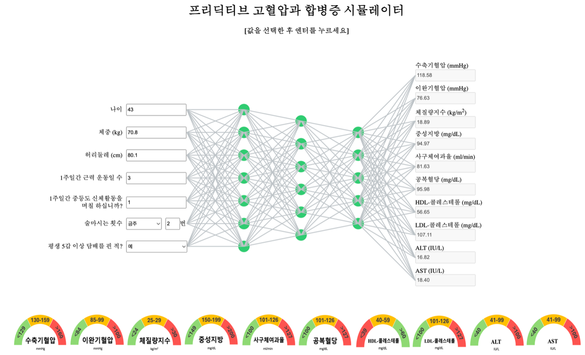

# Predictiv's Hypertension and Complications Simulator
### Powered and managed by Predictiv Care, Inc.
##### This is the english version of the hypertension and complications simulator. Please note that all data and IDs were randomized and so any matches in data is purely coincidential.
## Installation & Setup

Instructions are for mac but you will be able to still do this on windows

[Install Python] https://www.dataquest.io/blog/installing-python-on-mac/

[Install pip] https://phoenixnap.com/kb/install-pip-mac

If you have Python & pip installed then check their version in the terminal or command line tools

```
python3 --version
```

```
pip3 --version
```

## Installing Flask(and other needed packages)

Go to terminal

First, change to the folder using cd. 

```
cd ~/Downloads/Hypertension_and_Complication_Simulator_v3_Translated
```

In your terminal run the requirements.txt file using this pip

```
pip3 install -r requirements.txt
```


## Running Application in Terminal

```
python3 app.py
```


## Running Application in browser

Go to the following link on a browser
http://127.0.0.1:5000

The final result should look similar to the following picture.

